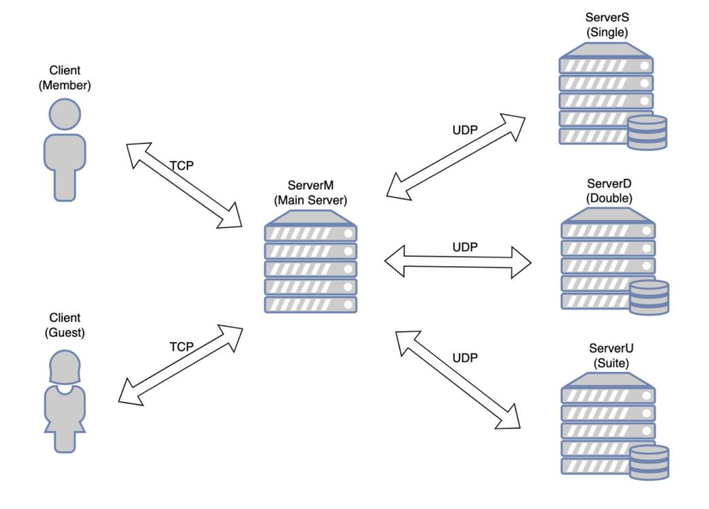

# Dorm Reservation Networking / Sockets Project

## About
This project was created with the goal of simulating a simple networking system that uses both TCP and UDP for transport 
layer protocols in C++. For better visualization and understanding, I used a dorm room booking system as a model. Clients
can log in as a member or a guest, and can query different types of rooms. Each different kind of room, single rooms, doubles, 
or suites have their own designated backend server. Logic and routing is done at the main server.

User information such as their usernames and passwords are encrypted during transport for security. For information about
the encryption scheme, see the encrypt() and decrypt() methods in client.cpp and serverM.cpp, where encryption is handled.

  
   
  <em>Figure 1: System diagram of the dorm room booking system.</em>

## How to Run Program
To run this program, open 1 terminal for serverM, serverS, serverD, serverU. Make sure to cd into the src for each terminal. 
In the first terminal, run "make all" to compile the program, and ./serverX to run each server (Replace X with M, S, D, 
or U depending on the server you are starting). 

As a user, you'll run ./client in another terminal. For each user using the system at the same time, you can simply run
./client in another terminal. From there, you can log in, make queries, and the system will transport messages to feed
you information! How cool!

All login information is in ./data/member_unencrypted.txt, which can modify this so that you have your own login. Make
sure that if you add a username and password pair to the database, that it is both in ./data/member_unencrypted.txt and 
./data/member.txt. 

## Main Server
### `ServerM.cpp`
(1) Functionality

The main server, also known as ServerM, is the intermediate server between the client and backend server. The main server 
communicates to clients using TCP, and to backend servers with UDP. The purpose of the main server is to verify the 
identities of users who don't log in as a guest. The main server forwards queries to their appropriate backend servers, 
and also handles invalid or error requests. The main server also has the ability to decrypt username and password so that 
they can be displayed on the main terminal.

(2) Message Formatting

Login authentication results are sent back to the client in the form of a single-length string ("s", "p", or "n"). Action 
requests (Availability or Reservation) are sent to the backend server in the form ("Action RoomCode username"). Action 
results are sent back to the client in the form ("Action preRoomCount aftRoomCount"). The logic is then easily handled by 
the client.

## Backend Servers
### `ServerS.cpp`  `ServerD.cpp` `ServerU.cpp`
(1) Functionality

The backend servers act as a database for the availability of dorm rooms. They report back to the main server, specifying 
information about rooms such as whether they exist, if they're available, or unavailable. The backend servers only communicate 
with the main server, and do so through UDP connections.

(2) Message Formatting

Action results are sent back to the main server in the form ("Action preRoomCount aftRoomCount").

## Client Server
### `Client.cpp`
(1) Functionality

The client server handles requests from users. They accept queries from users, and are sent directly to the main server. 
Queries contain usernames, passwords, the type of query (i.e. Availability or Reservation), and room number. This information 
is sent to the main terminal, where most of the logic is done. Once processed, the main server will be sent back to and 
received by the client, where the response is then displayed.

(2) Message Formatting

Authentication requests are sent to the main server in the format ("userType username password"). Action Requests are sent 
to the main server in the format ("Action RoomCode"). The main server already knows if the user is a member or a guest from 
the authentication request.

(3) Edge Case

If the user input for request type does not match either "Availability" or "Reservation" exactly, the program will automatically 
re-prompt the user enter a request type.
